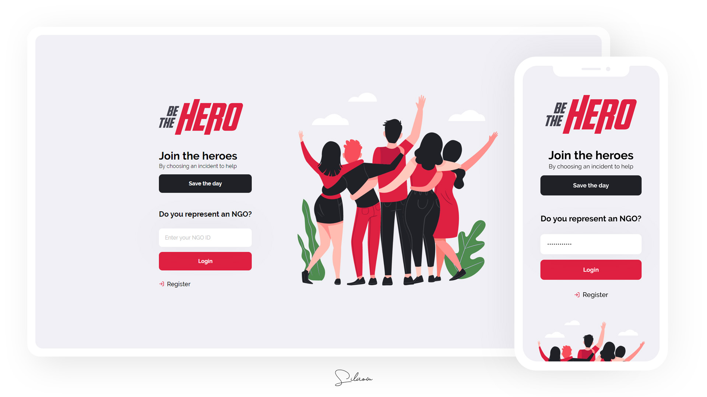
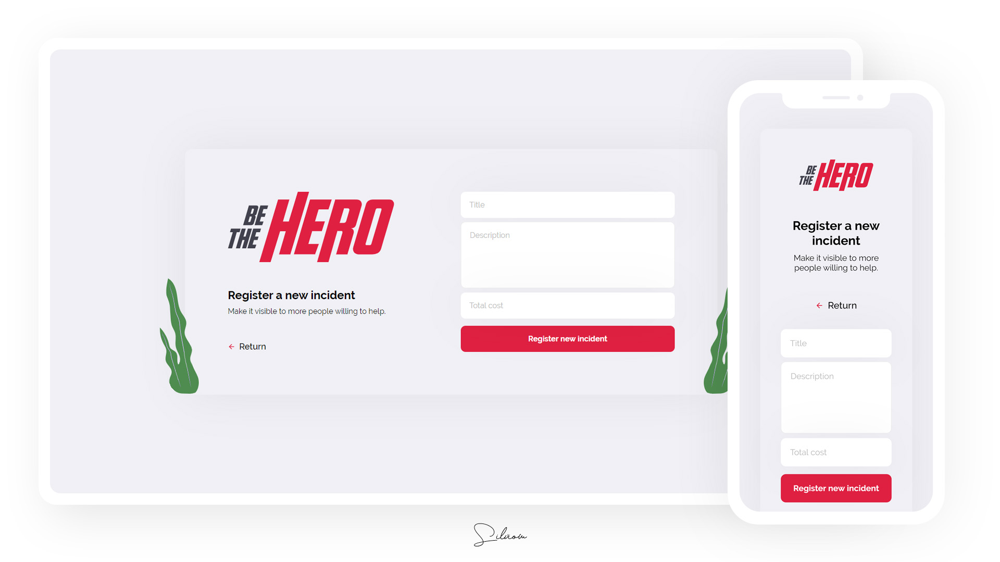
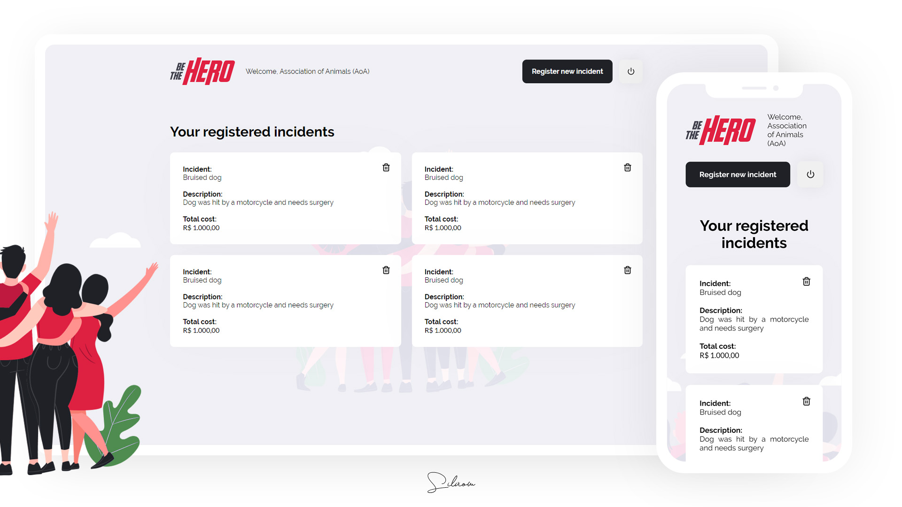

# Be The Hero
:pray: An app to help NGOs.

Cross-platform application developed for study purposes with Node.js, React.js and React Native during [@Rocketseat](https://github.com/rocketseat)'s "Semana Omnistack 11" event.

Some technologies and tools used on this project:

- Node.js
- Express
- Knex
- SQLite
- React.js
- React Native

